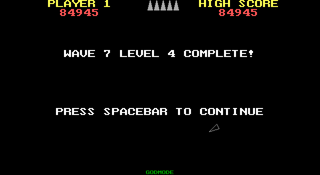
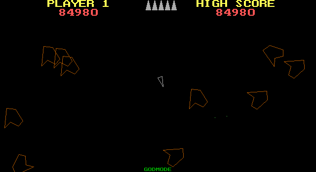
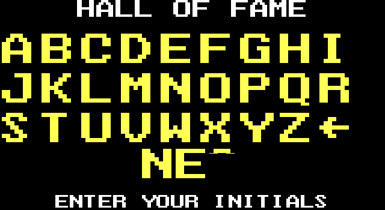
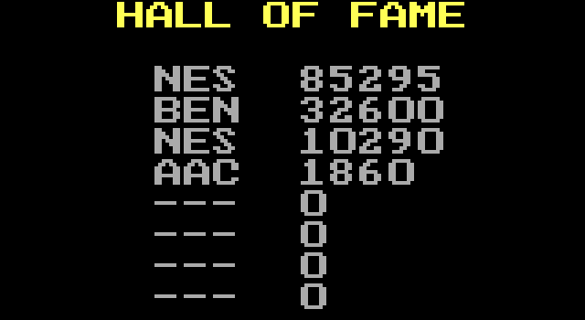

# Asteroids for Pascal

This is a clone of the classic arcade game "Asteroids," written in Turbo Pascal using the BGI library for graphics.

This project was written by Nicholas Smith in November 2000 for a Programming Concepts II class.

## Screenshots

## How to Play

This game was designed for a DOS environment. You can run the game by executing `ASGN_008.EXE`. On modern systems, you may need to use an emulator like [DOSBox](https://www.dosbox.com/) to run the executable.

### Controls

-   **LEFT/RIGHT ARROWS:** Steer the ship
-   **UP ARROW:** Accelerate
-   **CTRL:** Fire Cannon
-   **P:** Pause
-   **ESC:** Quit

### Gameplay

- You get an extra life every three levels completed (up to a maximum of 5).
- The game features a high score table that is saved to `SCORES.HI`.

## Source Files

-   **`ASGN_008.PAS`**: The main game source code.
-   **`KEYBOARD.PAS`**: A custom keyboard handler unit.
-   **`SHIP.OBJ`**: Object file defining the player's ship.
-   **`ASTEROID.OBJ`**: Object file defining the asteroids.
-   **`EGAVGA.BGI`**: Borland Graphics Interface driver for EGA/VGA displays.
-   **`HISCORES.DAT` / `SCORES.HI`**: High score data files.

## Developer Notes (from source)

-   The code was written by Nicholas Smith (`imnes@go.com`).
-   The game was written for a class project at Pensacola Junior College.
-   The author noted some features were not finished:
    -   Asteroids do not split into smaller chunks.
    -   The player is not initially invulnerable after respawning.
-   There is a "God Mode" secret code (`IMNES`).

---
_This README was generated based on the project source files._
